# LastWave

**A beautiful Last.fm companion app for Android.**

This repo totally belong to [DUXTAMI](https://github.com/duxtami)

LastWave connects to your Last.fm account to surface your scrobble history, genre analytics, and smart playlist generation — all wrapped in a clean Material You interface.

<p align="center">
  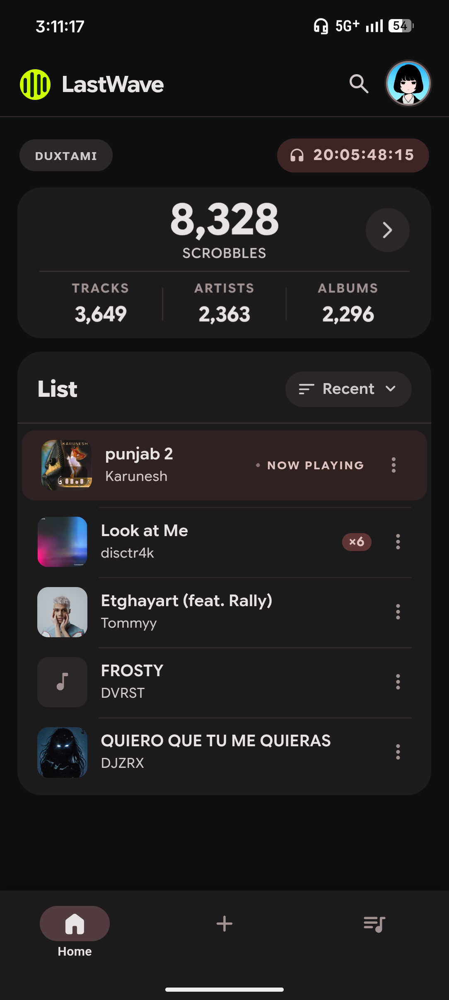
  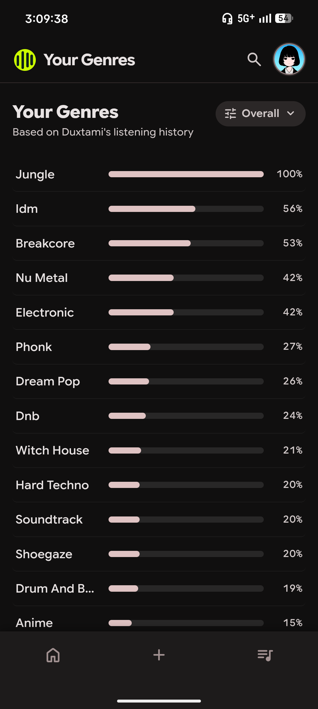
  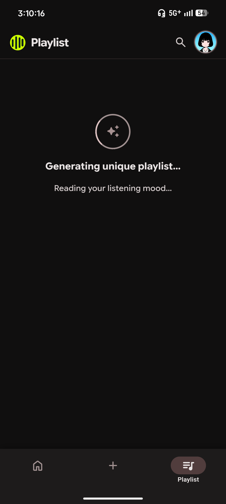
  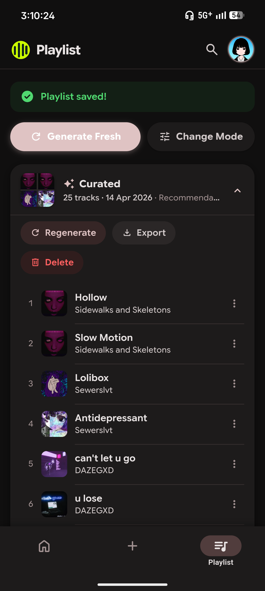
</p>

---

## Features

### 🏠 Home Dashboard
Your listening life at a glance. See your total scrobble count, unique track/artist/album stats, and a live-updating track list sorted by recency or play count. A real-time listening timer shows your cumulative headphone time as it ticks up.

<p align="center">
  
  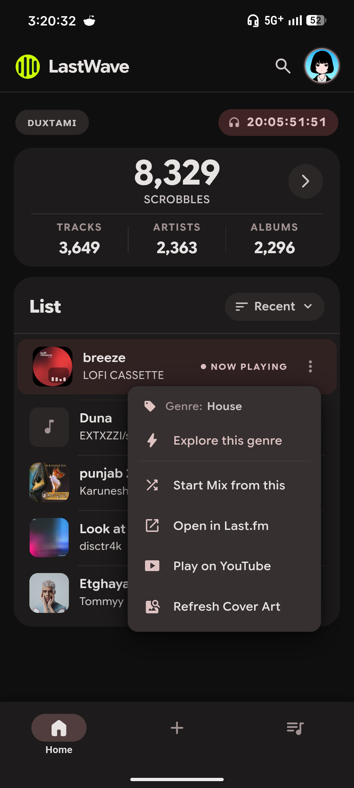
</p>

---

### 🎸 Genre Analytics
Discover what your listening habits actually say about you. LastWave analyses the tags across your top artists and builds a ranked breakdown of your genres. Filter by the past 7 days, this month, the last 12 months, or your all-time history.

<p align="center">
  
  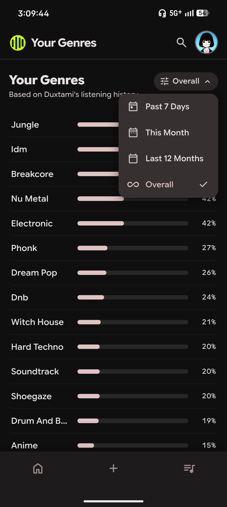
</p>

---

### ✨ Playlist Generator
Turn your scrobble data into ready-to-use playlists. Choose from eight generation modes:

| Mode | What it does |
|---|---|
| **Top Tracks** | Your most-played tracks of all time |
| **Recent Tracks** | What you've been listening to lately |
| **Similar Tracks** | Tracks similar to one you love |
| **Similar Artists** | Discover artists like your favourites |
| **By Tag / Genre** | Browse by genre — rock, lo-fi, jazz, and more |
| **My Mix** | Smart blend of top, recent & similar |
| **My Recommendations** | 30 fresh tracks picked just for you |
| **My Library** | Re-discover the sounds of your past |

<p align="center">
  
  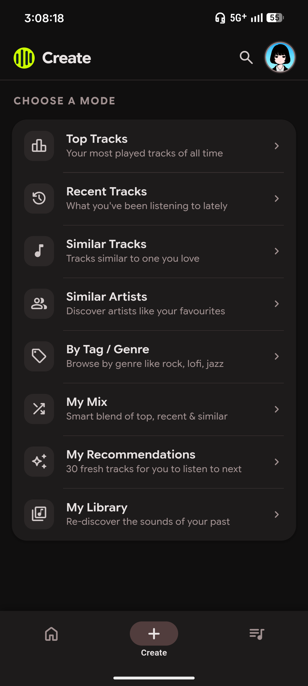
  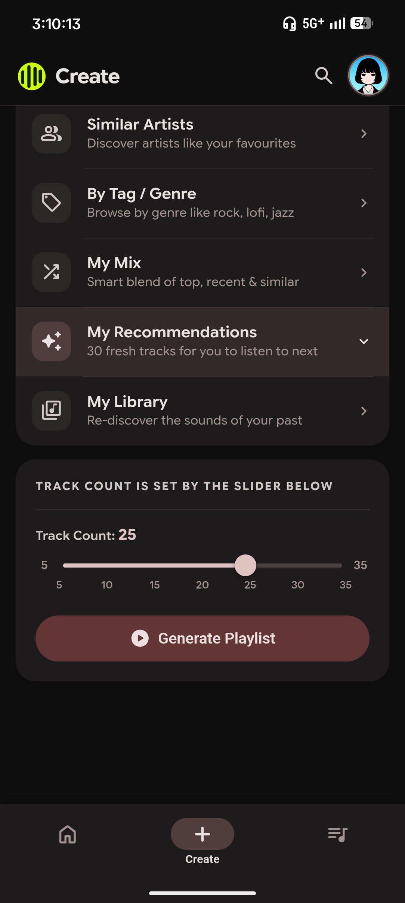
</p>

---

### 💿 Playlist Manager
All your generated playlists in one place. Regenerate a fresh shuffle, swap generation modes, or export to **CSV** or **M3U** to take your playlist anywhere.

<p align="center">
  
  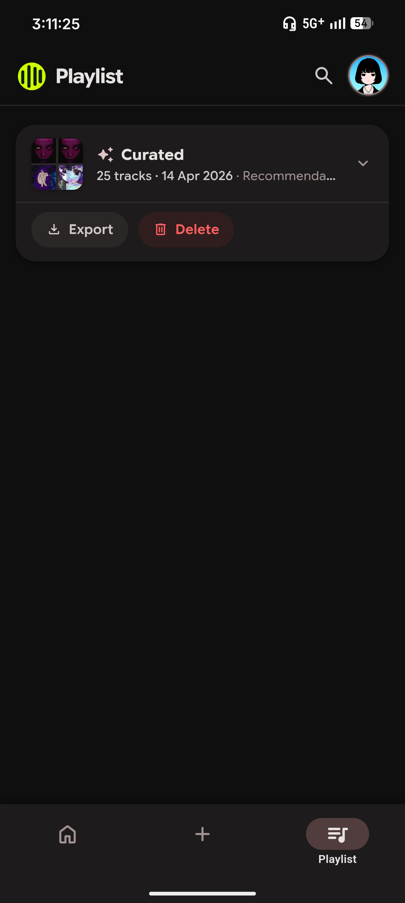
  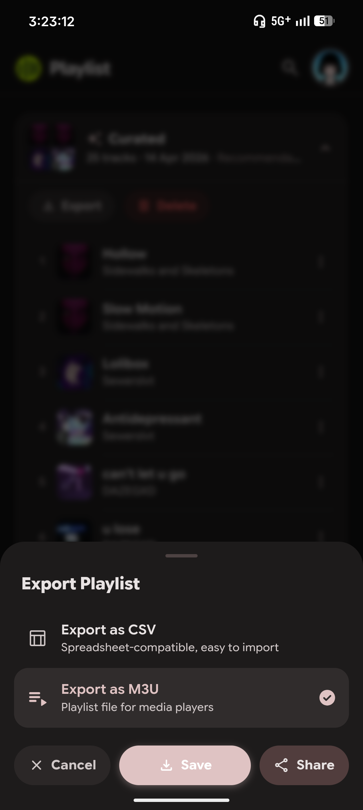
</p>

---

### 🔍 Search
Search across tracks, artists, and albums — all powered by the Last.fm catalogue.

<p align="center">
  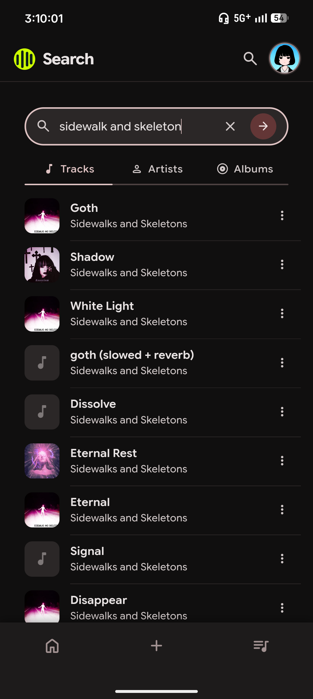
  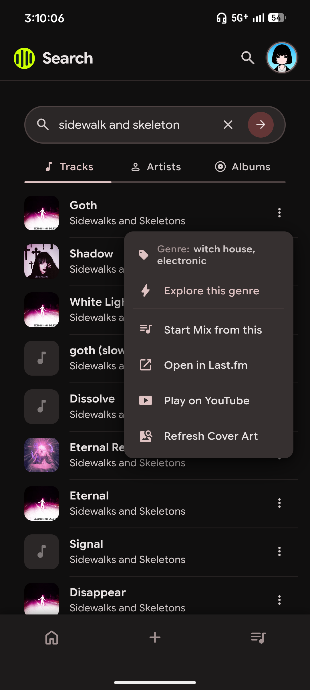
</p>

---

### 🎨 Themes & Personalisation
Pick from a curated set of Material You colour palettes, or dial in your own accent colour using the built-in colour wheel.

<p align="center">
  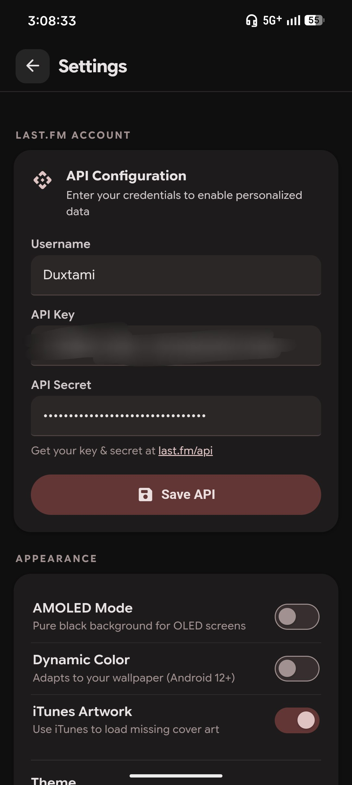
  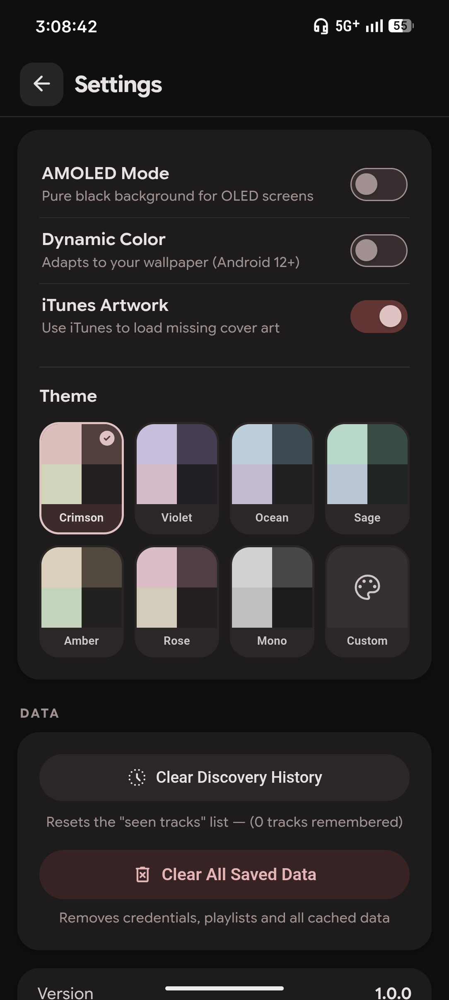
  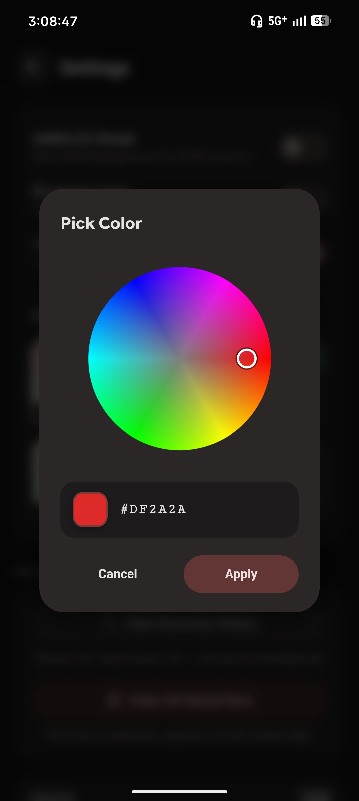
</p>

---

## Getting Started

LastWave uses the free Last.fm API. You'll need a Last.fm account and a personal API key to get started.

1. **Create a Last.fm API key** at [last.fm/api/account/create](https://www.last.fm/api/account/create) — it's free and takes about a minute.
2. **Install LastWave** on your Android device.
3. Open the app and go to **Settings**.
4. Enter your **Last.fm username**, **API Key**, and **API Secret**.
5. Head to the **Home** screen — your stats will load automatically.

---

## Requirements

- Android device
- A [Last.fm](https://www.last.fm) account
- A free Last.fm API key

---

## Building from Source

```bash
git clone https://github.com/your-username/lastwave.git
cd lastwave
./gradlew assembleDebug
```

Open the project in Android Studio, or build via the Gradle wrapper. The app targets a standard Android SDK setup with no external library dependencies beyond the Android framework.